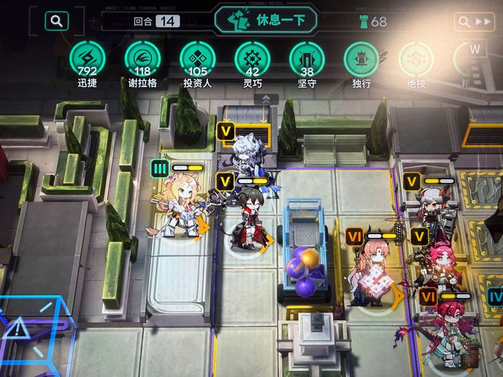

# 1999限定空降,周年庆惹恼玩家-百度贴吧

## 总结

## 总结

本文汇总了多个贴吧（如重返未来1999吧、明日方舟吧、星穹铁道内鬼吧）中关于手游《重返未来1999》近期节奏的讨论，主要围绕以下核心争议点：

1. **角色设计与“卖肉”争议**：玩家对新角色（如梅蕾尔、小瑞安侬）的服装设计提出批评，认为过于暴露或“媚宅”，尤其是小女孩珐琅眼的形象被指擦边。部分玩家反驳称，相比以往角色，新设计并不算过分，且美术风格整体尚可。

2. **福利与氪金问题**：周年庆福利被指缩水，仅增加少量抽卡资源（如100抽），对比往年不足。限时累充活动引发强烈不满，氪金玩家感觉被“背刺”，认为活动设计恶心且不平衡过往充值记录。

3. **角色加强与产能分配**：人气角色（如代号37）长期未得到加强，玩家质疑官方将产能用于圈钱（如出皮肤、周边），而非游戏内容优化。限定版本角色加强数量减少，加剧了玩家不满。

4. **剧情与设定争议**：梅蕾尔作为“if线”角色，其剧情设定（如与梅蕾尔的关系）引发讨论，有玩家期待深蓝能给出合理解释，但也有声音批评这种设定空洞或依赖路径依赖。

5. **社区节奏与玩家对立**：节奏涉及多个玩家群体（如角色厨、普通玩家），导致社区分裂。部分帖子指出，节奏可能被夸大或误导，并非所有玩家都认同核心争议点。

整体上，玩家对《重返未来1999》在角色设计、福利政策、氪金体验和内容更新方面的不满集中爆发，反映了对游戏长期运营的信任危机。
