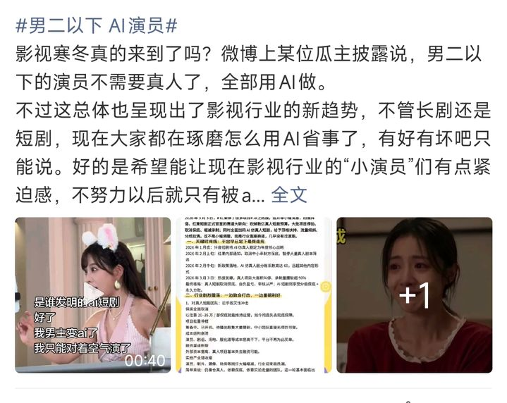
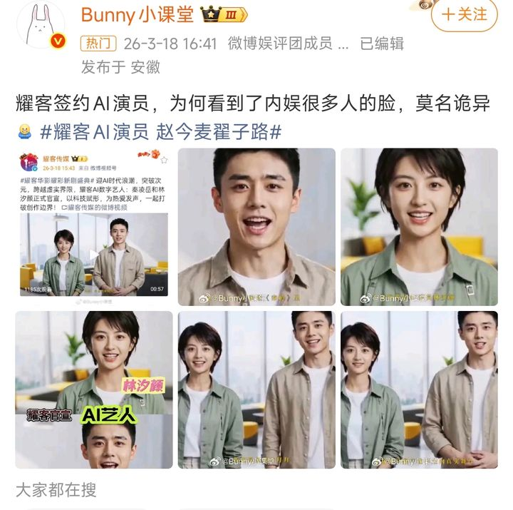
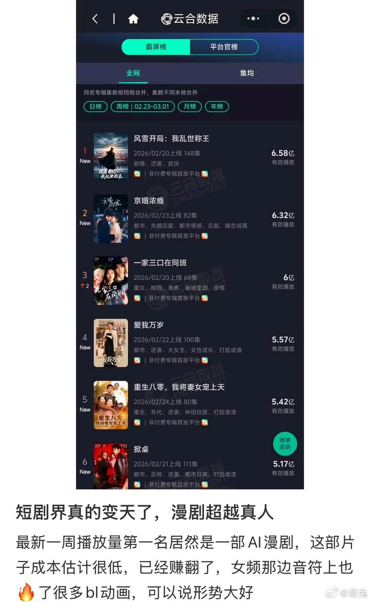
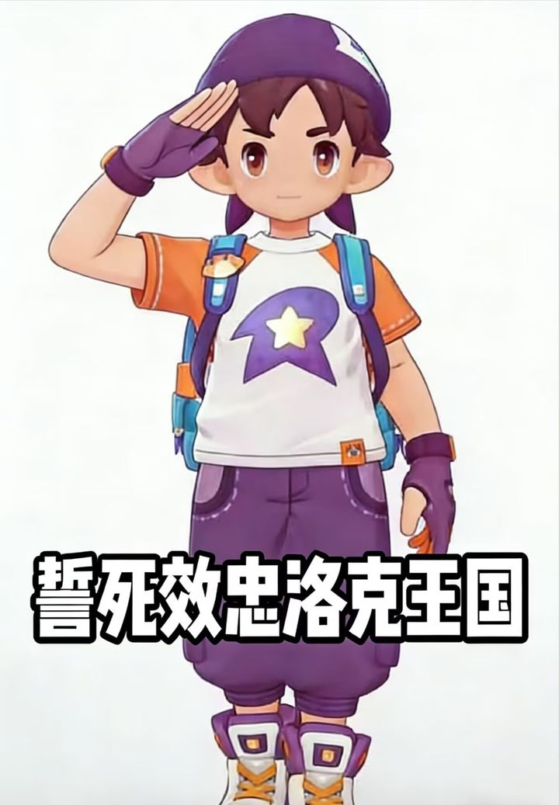

# AI围剿影视圈,演员签卖身契-百度贴吧

## 总结

## AI 对影视娱乐行业的冲击与争议

近年来，AI 技术在影视娱乐领域的应用日益广泛，引发了行业变革和广泛讨论。以下是基于相关贴吧帖子的总结：

### 一、AI 在影视制作中的具体应用
1. **AI 演员与数字艺人**：
   - 腾讯计划用 AI 制作长剧和电影，首批作品预计 2026 年第三季度上线，旨在降低演员片酬成本。
   - 耀客传媒签约 AI 数字艺人“林汐颜”和“秦凌岳”，引发网友抵制，批评其面部特征融合多位女星，被称为“人山人海脸”。
   - AI 演员无需片酬、无档期限制、可无限复用，在“降本增效”趋势下成为资本青睐的工具。
2. **AI 短剧与内容生成**：
   - AI 短剧爆发，低成本、高产能的仿真人短剧流行，例如“1500元买断一张脸”的肖像生意形成灰色产业。
   - AI 能生成以假乱真的视频内容，如孙悟空大战超人、奥特曼大战假面骑士等，冲击传统影视制作。
3. **AI 配音与声音授权**：
   - 有演员如赵乾景早期授权声音给腾讯，而游戏中使用 AI 配音替换原配音演员姜广涛（因不可抗力无法履行合同）。

### 二、行业反应与争议
1. **从业者焦虑**：
   - AI 被指取代真人演员，尤其是男二以下角色可能不再需要真人，引发明星和群演生存危机。
   - 爱奇艺 CEO 称“AI商业大片今年夏天或秋天就会落地”，加剧行业恐慌。
2. **公众抵制与伦理担忧**：
   - 网友抵制 AI 演员，认为其侵犯肖像权、缺乏人性化表演，例如费翔拒绝授权脸部给 AI 与巩俐、玛丽莲·梦露“同框演戏”。
   - 反对声音认为 AI 夸大危害，自动化工具如工厂机器与 AI 无本质区别，AI 无法独立生成作品。
3. **创作与版权问题**：
   - AI 创作冲击传统创作者，被指训练过程中侵权，传统创作者用版权限制 AI 并贬低其地位。
   - AI 生成内容虽高效，但缺乏人类创意的“不合常理”设定，可能影响作品深度和经典性。

### 三、未来展望
AI 技术正重塑影视娱乐行业，从降低成本到创新内容形式，但伴随失业风险、伦理争议和创作局限性。行业需平衡技术应用与人文关怀，探索 AI 与人类协作的新模式。
