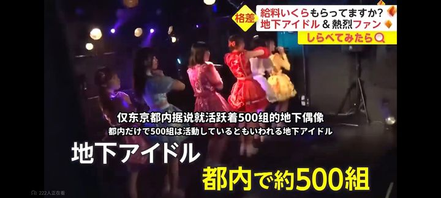
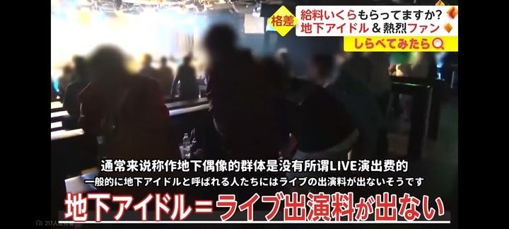
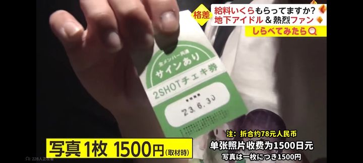

# 人多味大!偶像劝粉丝勤搓澡-百度贴吧

## 总结

## 日本地下偶像的生存现状

日本地下偶像（地偶）通常没有基本工资，收入完全依赖演出后的拍立得销售分成。根据电视台的薪资访谈，地偶与经纪公司的分成比例为3:7，即偶像本人仅能获得30%的收入。例如，一张售价1500日元的拍立得，地偶只能分得450日元。

### 收入水平
- **普遍情况**：绝大多数地偶的月收入在5万至10万日元之间。
- **极端情况**：如果无人购买拍立得，收入可能为零；而极少数的顶尖地偶月收入可达40万日元。

### 粉丝消费
有粉丝为了支持心爱的偶像，花费高达250万日元，平均每月支出15万日元。

### 生活压力
由于收入微薄，许多地偶除了演出外，还需拼命打工才能维持生计。经纪公司的分成比例被批评为“吸血”行为，因此建议地偶在有机会时尽量转向地面偶像（主流偶像）发展，以改善经济状况。

