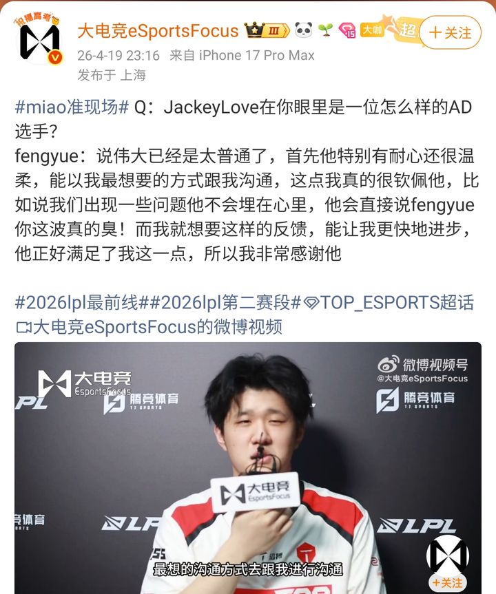
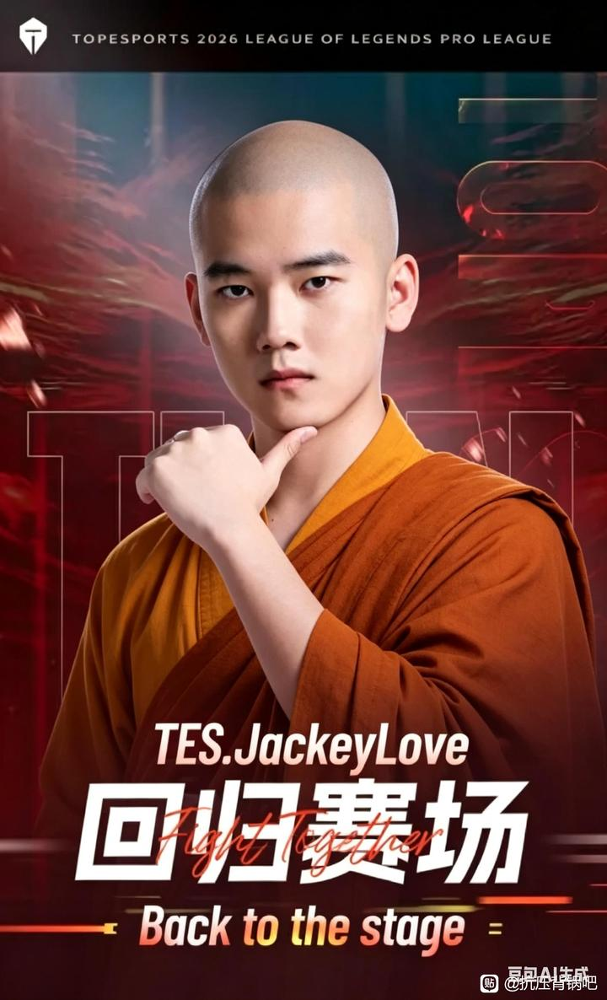
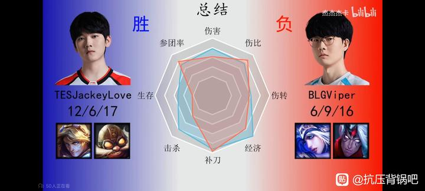

# 伟大无需多言!风月赛后狂吹JKL-百度贴吧

## 总结

本文汇总了多个关于英雄联盟职业选手JackeyLove（JKL）的讨论帖，内容涉及对他的评价、打法风格、与辅助的配合以及粉丝群体争议。

1.  **对JackeyLove的个人评价**：Fengyue（风月，一名辅助选手）在帖子中表达了对JackeyLove的感谢和高度赞扬。他认为JackeyLove不仅伟大，而且特别有耐心和温柔，能以最直接、有效的方式沟通，例如直接指出问题（如“fengyue你这波真的臭！”），这种反馈帮助Fengyue更快进步。Fengyue对此表示钦佩和感谢。

2.  **JackeyLove的打法风格与辅助配合**：另一个帖子比较了JackeyLove和另一位AD选手Elk的打法，认为两人风格相似，都偏向激进、擅长找机会、能carry比赛但有时粗糙，需要队友支援。然而，关键区别在于辅助的配合效果：JackeyLove的辅助无论原本水平如何，往往能成为“有阵辅助”（即表现提升），例如Fengyue从“菜的流油”进步到“和坑不沾边”；而Elk的辅助（如Hang）则表现下滑。这暗示JackeyLove可能对辅助有提升作用。

3.  **粉丝群体争议**：有帖子批评JackeyLove的粉丝群体（被戏称为“尿罐子”），指责他们行为恶臭，在常规赛赢几场后就过度吹捧，并对JackeyLove的队友和对手（如Rookie、TheShy、Uzi等）进行无端攻击。帖子列举了多名受影响选手，并讽刺粉丝不看比赛、双标（如将JackeyLove的失误美化为“伟大”）。

4.  **对JackeyLove未来的畅想**：一个帖子以“伟大无需多言”为题，畅想JackeyLove带领TES战队取得辉煌成就：赢得LPL联赛冠军、MSI冠军，并以一号种子身份在世界赛横扫LCK赛区，夺得个人第二冠后退役。这被形容为“爽文男主”般的剧情，是献给LPL观众的“情书”。

整体来看，讨论呈现两极分化：一方面，选手和部分观众认可JackeyLove的实力、沟通能力和对团队的正面影响；另一方面，其粉丝群体的极端行为引发争议，同时也有对其未来成就的乐观预测。
