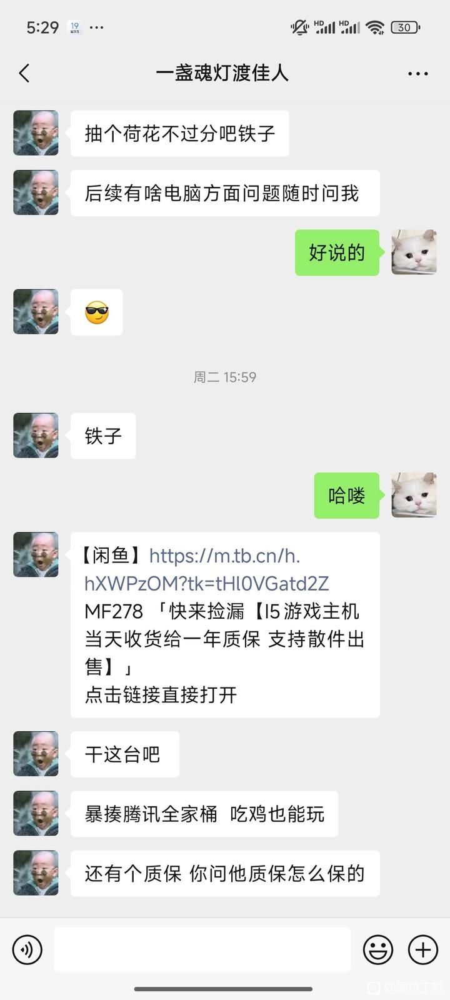
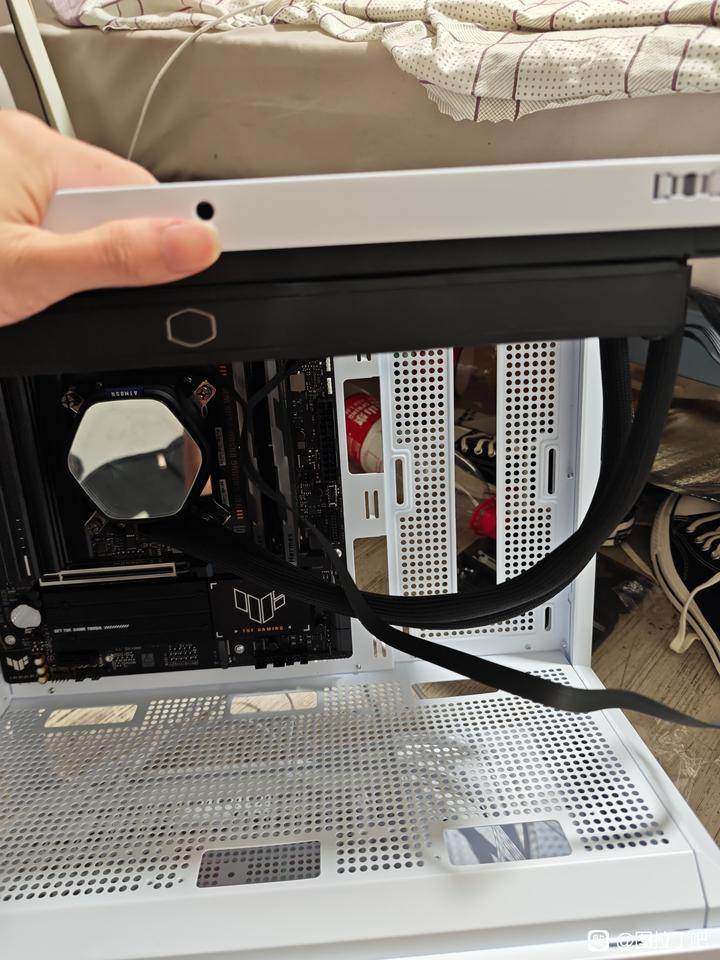

# 吧友装机被骗,boot收费500-百度贴吧

## 总结

## 相关贴推荐总结

本内容汇总了多个贴吧用户分享的装机（组装电脑）相关经历，主要集中在求助、被骗案例和配置咨询等方面，揭示了DIY装机市场中存在的欺诈行为和常见陷阱。

### 主要案例概述

1. **代找整机被骗**：一位用户因骨折在家休养，想快速购买一台预算2000元的电脑玩《英雄联盟》和《绝地求生》，在图拉丁吧发帖求助。一名6级用户主动联系，承诺仅需一包“荷花”香烟作为报酬帮忙在闲鱼寻找整机。用户最终支付了580元购买了一台杂牌电源的整机，事后发现配置一般且价格虚高，机箱外观也不满意，但卖家拒绝包邮。

2. **上门装机被收取高额费用**：用户自行装机到一半因走线复杂，花费180元请人上门安装。完成后，对方额外收取500元“刷boot”服务费和1200元微软正版系统服务费。用户争论后未支付系统费用，但被迫支付了500元“刷boot”费，事后查询发现“boot”概念不明，疑似欺诈。

3. **维修中被偷换配件**：用户主板损坏，在闲鱼找店铺维修。维修人员收取395元费用后，偷换了用户原有的三根DDR4 16GB 2133MHz三星服务器内存条、E5主板和CPU，替换为杂牌8GB内存条和H510主板，声称以旧配件抵债。

4. **电源测试欺诈**：用户自行配置好电脑配件后，请师傅装机。师傅测试电源时声称有问题，拿出一个杂牌新电源测试并开封，强行要求用户支付1100元购买，远高于用户自购的海韵电源价格（约1000元），并以报警威胁。

5. **付费咨询被骗**：用户在贴吧发求助帖后，有人留言提供有偿咨询，收费35元。用户通过微信支付后，对方以未备注为由要求重复支付，后又通过支付宝索要70元，拒绝退款，最终用户损失105元。

### 其他相关内容
- **配置咨询**：有用户分享自己拟定的电脑配置单（总价7808元），寻求改进建议，并附带了相关图片。
- **硬件知识科普**：帖子揭露了某些装机商家的欺诈手段，如使用骨伽电源（前身为口碑差的红星电源）虚标功率，以及推荐使用QLC颗粒的固态硬盘（如致钛Ti600、金士顿NV3）来牟利，提醒小白用户注意避坑。
- **非装机内容**：包含一篇关于在家种植花生芽的教程帖，分享选种、浸泡、托盘选择等技巧，与装机主题无关。

### 核心问题与警示
- **欺诈模式多样**：包括代找整机收费后提供低质产品、上门服务中虚构项目（如“刷boot”）收取高额费用、维修时偷换高价值配件、测试环节强卖杂牌硬件，以及线上付费咨询诈骗。
- **受害者特征**：多为对电脑硬件了解有限的小白用户，因图省事或缺乏经验而寻求外部帮助，容易成为欺诈目标。
- **平台与社区作用**：贴吧（如图拉丁吧、防诈骗吧）成为用户分享经历、求助和警示的重要平台，但同时也存在欺诈者活跃的风险。

### 建议与总结
- **提高警惕**：在寻求装机、维修或咨询服务时，应选择信誉良好的商家或个人，避免轻信低价或快速服务承诺。
- **自学知识**：建议用户通过B站等平台学习基础装机知识，减少对外部帮助的依赖。
- **保留证据**：交易过程中保留聊天记录、支付凭证和配件照片，以便在发生纠纷时维权。
- **社区互助**：利用贴吧等社区进行咨询，但需注意甄别信息真伪，参考多来源建议。

整体而言，这些帖子反映了DIY装机市场中存在的信任缺失和欺诈问题，强调了用户教育、社区监督和自我保护的重要性。
