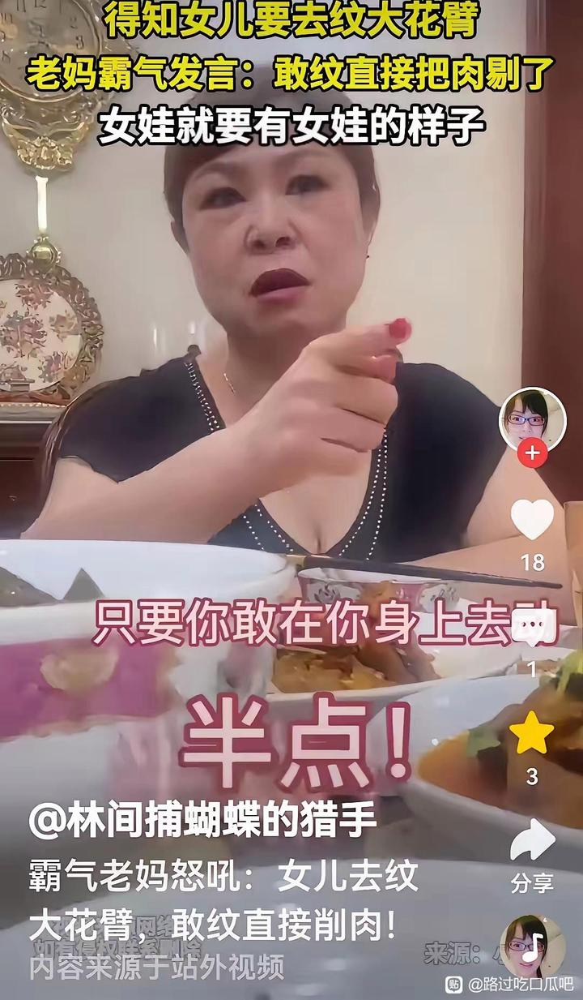

# 孩子被骗纹花臂,家长崩溃-百度贴吧

## 总结

一位女儿向母亲表达想纹身的意愿，母亲态度坚决地予以反对，强调“女儿要有女儿的样子”，并要求女儿立即打消念头。当女儿追问如果自己执意纹身会怎样时，母亲回应说会“把纹身的那块肉剔了”。此事源于媒体报道的一对母女因纹身问题激烈争吵，母亲的回复虽显严厉，却引发广泛共鸣，让人深思。事件起因是女儿看到身边朋友纹身后觉得有个性，从而产生了纹身的想法。

