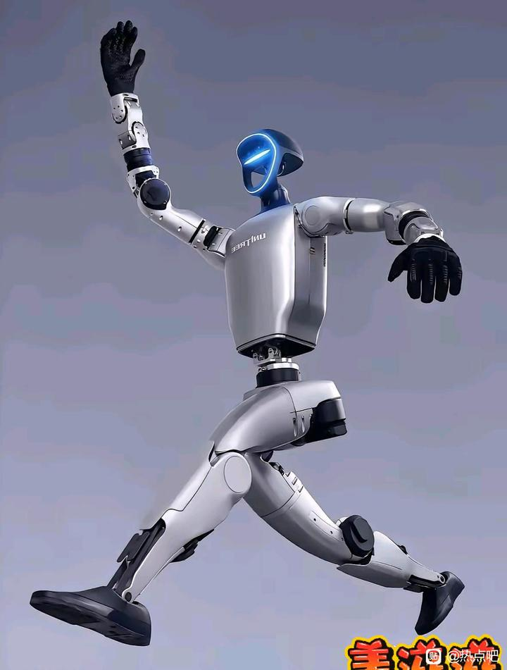
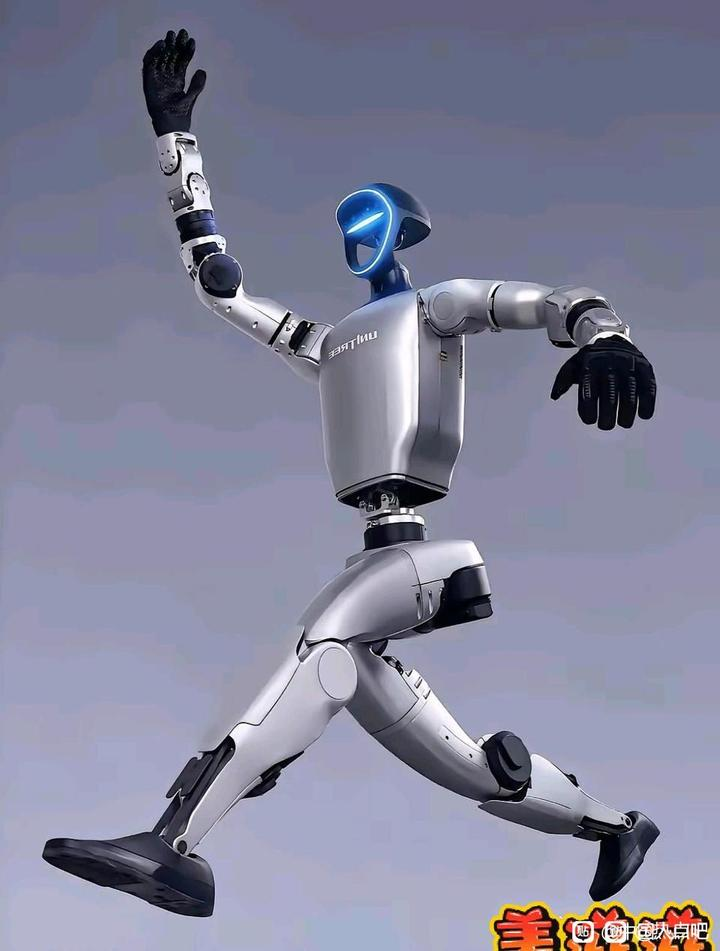
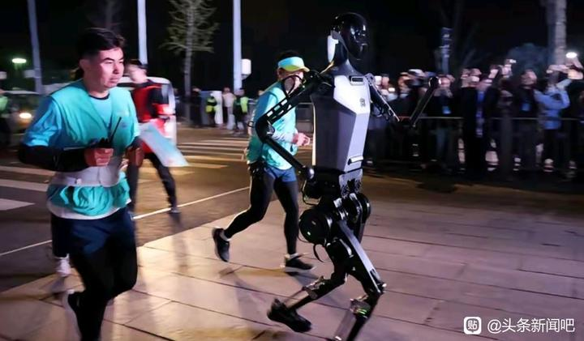
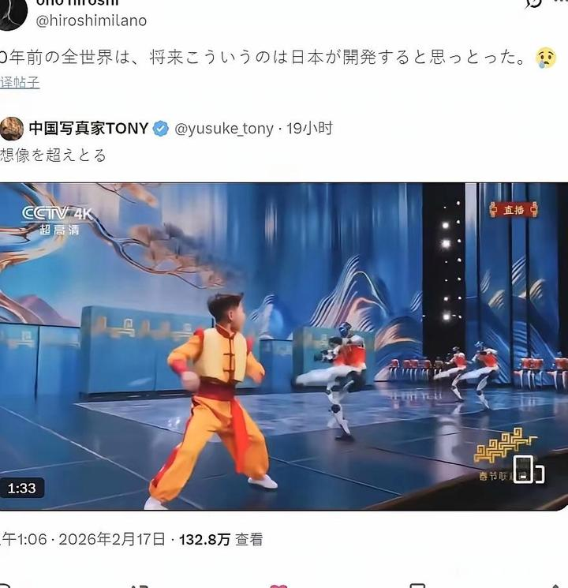

# 日本开发新脑洞:机器人拆开做-百度贴吧

## 总结

## 相关贴推荐总结

以下是针对提供的相关贴推荐内容的总结，涵盖了多个关于人形机器人（特别是宇树科技产品）的讨论帖，涉及技术、经济、社会影响及文化对比等方面。

### 1. 宇树机器人售价与“危机感”讨论
- **核心内容**：用户讨论宇树机器人售价约9.9万元（近10万元），强调其功能强大（能完成人类可做和不可做的任务），且无需社交、不抱怨加班、不要求涨工资，被视为“劳动模范”。这引发了关于机器人替代人类工作、老板偏好高效听话员工的“危机感”。
- **实例佐证**：一个案例提到，珠三角工厂引入三条机械臂后，工人从20多人减至3人，产量未减，次品率从8%降至2%，突显自动化带来的效率提升和成本节约。
- **图片引用**：相关讨论中可能包含工厂自动化场景的图片，例如机器人工作场景。

### 2. 人形机器人跑步成绩超人类
- **核心内容**：宇树科技H1人形机器人（2023年改版）在2025年北京人形机器人马拉松排位赛中自主跑完1.9公里多弯道赛程，用时4分13秒，按比例计算打破人类1500米世界纪录（平均配速7.51米/秒，远超人类纪录的3分26秒）。机器人具备自主导航、避障和节奏调整能力，并在排位赛中夺冠。
- **背景信息**：宇树科技起源于大学宿舍的“机器人梦”，创始人王兴兴从简陋双足机器人起步，逐步开发核心技术；2025年，其人形机器人出货量全球第一。
- **图片引用**：可能展示机器人跑步比赛或技术细节的图片。

### 3. 机器人自我意识的哲学讨论
- **核心内容**：用户提出如果机器人产生自我意识，是否还能归类为“机器”，这超出了传统机器定义，引发科幻和哲学层面的思考。讨论涉及机器人分类和伦理问题。

### 4. 日企加速引入中国人形机器人
- **核心内容**：日本企业开始与中国宇树科技合作，引入人形机器人G1进行测试。例如，日本AI初创企业ZEALS在筑波大学附属医院使用G1进行导诊和夜间巡逻测试，机器人能用自然日语回应患者问询并引导至指定区域。这反映了中国机器人技术在国际合作中的应用。

### 5. 文化对比：中日机器人发展路径
- **核心内容**：对比日本和中国在机器人研发上的不同选择。日本曾计划2025年建立月球基地但未实现，被指将资金投入动画和广告而非机器人研发；中国则以科技为重点，未发展“小人书”（指动画），因此在春晚等场合展示机器人表演，突显技术进步。
- **图片引用**：可能涉及春晚机器人表演或日本文化对比的图片。

### 6. 台湾节目中的机器人误认事件
- **核心内容**：台湾电视节目中出现穿和服、会说台语的机器人，被吹嘘为日本机器人，但实际是宇树G1的老版本。这被调侃为“台湾很希望日本出机器人”，反映了地区对机器人来源的误解或期望。
- **图片引用**：可能展示节目中的机器人形象。

### 总体趋势
- 讨论围绕宇树机器人展开，涵盖技术突破（如跑步成绩）、经济影响（如替代人工）、国际合作（如日本引入）和文化对比（如中日发展差异）。
- 机器人技术正从实验室走向实际应用，引发社会、经济和哲学层面的广泛讨论。
