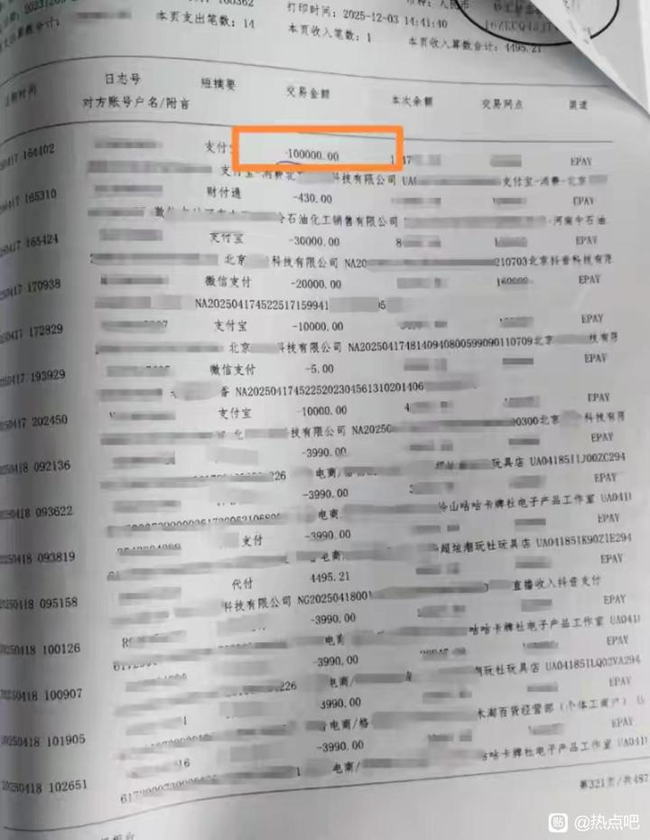
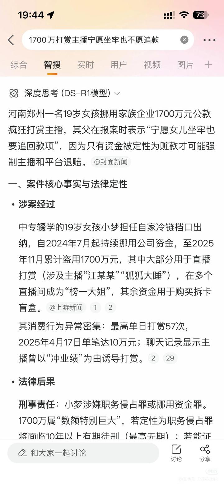

# 榜一挪用千万公款打赏主播-百度贴吧

## 总结

## 直播打赏乱象与监管新规

近期，一系列与直播打赏相关的社会事件引发广泛关注，凸显了该领域存在的严重问题，包括挪用公款、家庭财产损失、情感纠纷等。同时，中央网信办发布新规，旨在加强打赏管理，规范行业行为。

### 典型案例：挪用公款与家庭悲剧

1.  **19岁女孩挪用1700万元打赏主播**：河南郑州一名19岁女孩小梦，在负责自家冷链档口出纳工作时，私自挪用资金1700万元用于打赏主播，成为“榜一大姐”。其父亲朱先生打拼多年积累的财富被挥霍一空，面临带女自首以追回赃款的两难境地。
2.  **团播挪用公款案**：有案例涉及挪用公款打赏团体直播（如丝芭相关直播），可能面临刑事立案和赃款追回。平台自建直播系统在数据控制和退款处理上更具优势。
3.  **抵押房产打赏女主播**：一名男子将家庭唯一住房抵押贷款，所得款项用于打赏女主播，从2023年12月持续至2024年12月，导致家庭陷入财务危机，母亲情绪崩溃。
4.  **未成年人盗用资金打赏**：河南周口一名16岁女孩偷拿爷爷手机，在一个多月内打赏16000元给主播，这笔钱相当于爷爷卖16000个烧饼的收入，给家庭带来沉重负担。

### 情感与心理影响

- **精神出轨与婚姻破裂**：有案例显示，丈夫因给主播打赏数万元并多次精神出轨，导致妻子无法忍受而离婚。
- **寻求网络存在感**：一名男子因生活不顺和情感刺激，在抖音打赏主播近6600元，其中4800元给一名新主播，短暂成为“榜一大哥”以寻求心理慰藉。

### 监管新规：中央网信办11条规定

为应对乱象，中央网信办于4月13日发布《关于加强网络直播打赏规范管理的通知》，核心内容包括：
- **打赏规则明示**：平台必须清晰公开打赏规则，避免隐藏信息。
- **取消榜单排名激励**：打赏金额不再影响排位，削弱“榜一大哥”的虚荣驱动。
- **强制限额与提醒**：设置打赏上限，并加强消费提醒功能。
- **权限管理**：对违规账号的打赏权限进行限制，需处置期满后方可重新开通。
- **未成年人保护**：强化措施防止未成年人非理性打赏。

### 行业反思与疑问

- **“神豪”打赏真实性**：有讨论质疑抖音上“神豪”老板（如75级账号标价2000万元）是否全部使用现金硬刷，涉及资产规模可能达上亿元，引发对打赏资金源的关注。
- **平台责任**：自建直播平台在用户数据掌控和退款处理上更具优势，而依赖第三方平台可能面临数据缺失和损失。

这些事件和新规共同反映了直播打赏生态中存在的风险，包括财务滥用、家庭矛盾和心理依赖，监管措施旨在促进行业健康化和用户权益保护。
