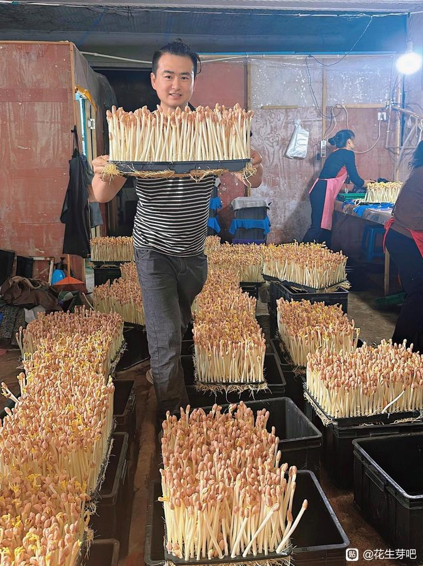

# 版权卫士vs盗版王,日俄网友开撕-百度贴吧

## 总结

## 自己种花生芽大半年，总结少走弯路的小技巧

之前总在市场买花生芽，感觉贵还不新鲜，就试着自己在家种。从一开始总烂根、芽苗细弱，到现在每次都长得又粗又脆，也算摸出点门道，分享给想试试的朋友：

1. **选种子**：别贪便宜，挑颗粒饱满、没破损的当季新种。泡之前最好一颗颗捡一遍，把瘪的、坏的挑出去，不然容易发霉。
2. **泡种子**：用温水（30度左右），泡6-8小时就行，别泡太久，不然容易烂。
3. **托盘选择**：一定要选圆孔的，一粒一粒整齐种好，不然不透风，芽苗容易发黄。
4. **保持湿度**：不用换水，保持托盘底部湿润即可，避免积水导致烂根。

这些技巧基于半年多的实践经验，旨在帮助新手提高成功率，种出又粗又脆的花生芽。
