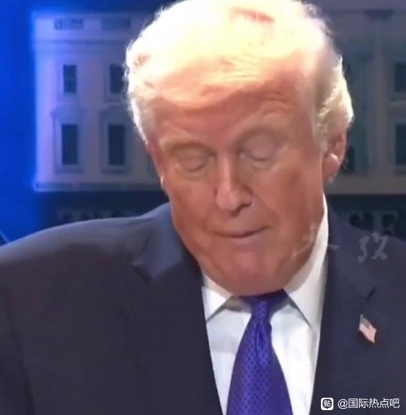

# 美国启动一万亿元退关税-百度贴吧

## 总结

## 特朗普遭遇重大司法挫折：最高法院裁定其关税战非法

特朗普在再次执政后遭遇了最重大的挫折，被CNN评价为“压倒性失败”。这一裁决由保守派占主导的美国最高法院于2月20日以6:3的票数作出，裁定特朗普去年4月发动的全球关税战非法，超出了总统的职权范围。

裁决结果令特朗普愤怒不已。据报道，他当时正与州长们共进早餐，收到一张小纸条后痛骂“这真是丢脸”，随后脸色铁青地扬长而去。最高法院共有9名大法官，其中6名是共和党任命，但裁决仍以多数票通过，凸显了司法独立性。

这一事件标志着特朗普“关税之王”策略的重大挫败，可能对其政治和经济政策产生深远影响。
