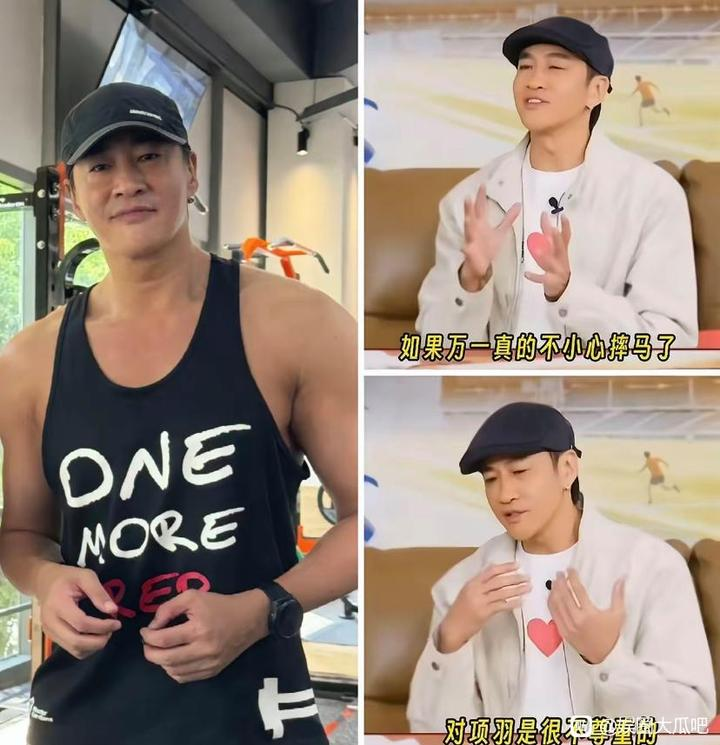
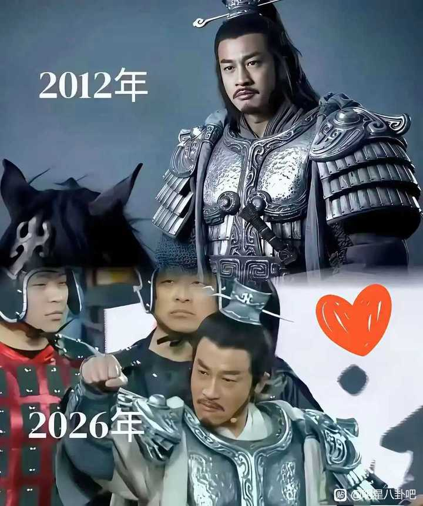
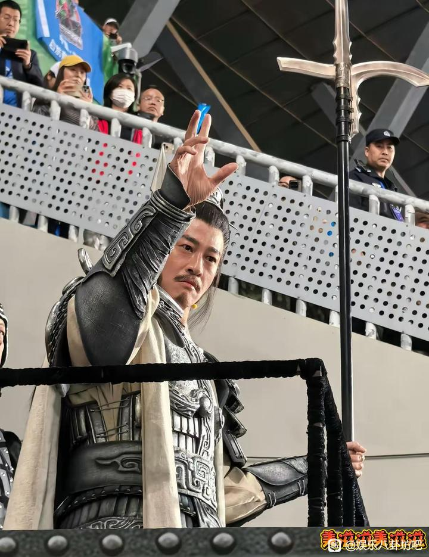
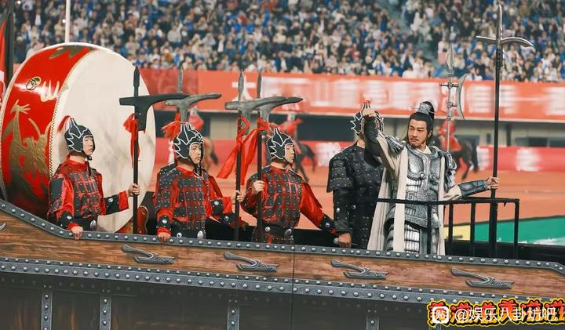
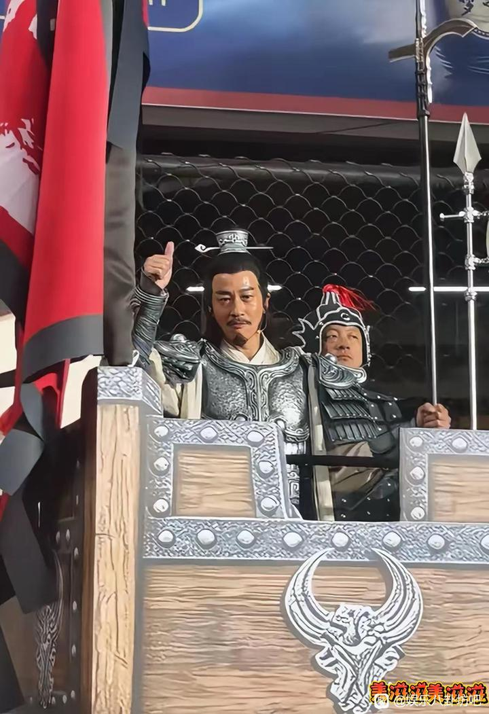
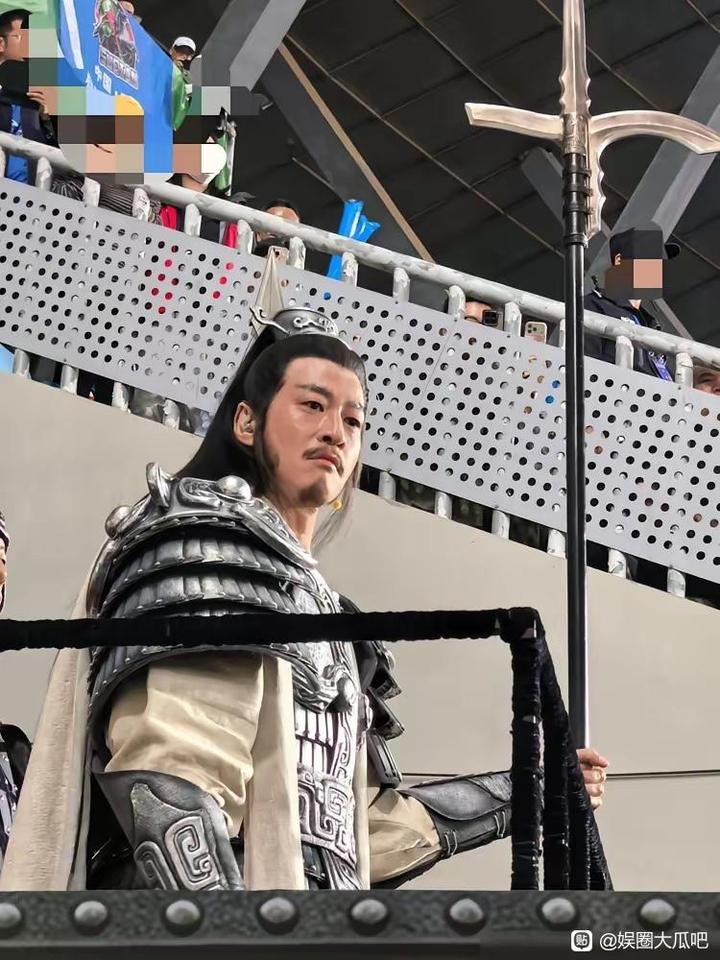
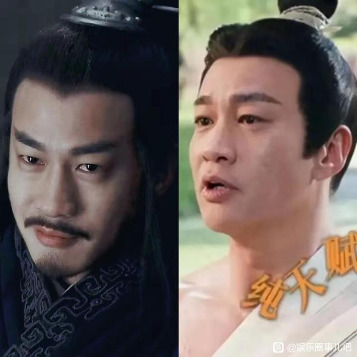
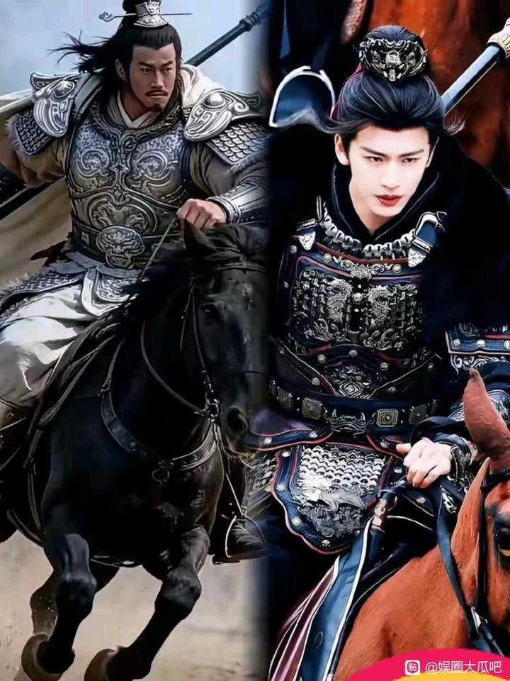

# 霸王助阵文旅,宿迁热度空前-百度贴吧

## 总结

## 何润东因“项羽”角色翻红事件总结

近期，演员何润东因其14年前在《楚汉传奇》中饰演的“项羽”一角意外翻红，引发网络热议。这一现象主要源于网剧《逐玉》的播出，剧中角色“粉底液将军”（由张凌赫饰演）的表演受到批评，反而让观众怀念起何润东版的项羽，形成对比效应。何润东因此获得大量关注，粉丝数在短时间内增长超过200万，总粉丝数突破600万。

### 关键事件：苏超助阵与战甲复刻
何润东受邀为宿迁队助阵苏超比赛，他并未将此视为普通商演，而是主动联系《楚汉传奇》原班制作团队，紧急复刻了当年那套重达20斤的霸王战甲。 这套战甲注重细节，如甲片采用金属做旧质感，下半身使用轻便材料以便活动，耗时15天完成。何润东在活动中身穿战甲，手持礼戈，重现项羽风采，现场氛围感人，他本人也激动得眼眶泛红。 这一行为被赞为“敬业”和“有责任感”，而非单纯捞金，体现了对角色的初心和宿迁“家乡”的情感连接。

### 个人特质与公众反应
何润东在回应不骑马争议时，坦诚自己51岁的年龄和体力已不适合骑马，避免了对项羽形象的不尊重，展现出真诚和担当。 此外，他因“网瘾大”（热爱打游戏）和健身靠妻子监督等个人生活细节，被网友认为“纯粹”且不易受饭圈文化影响。翻红后，他迅速接获多个商务合作，包括安慕希、京东、支付宝等品牌，估计进账600-1200万元人民币，被戏称为“隔空掀桌”的赢家。

### 文化影响与城市宣传
这次事件不仅提升何润东个人知名度，还带动了宿迁的城市宣传。宿迁作为“项王故里”，借助何润东的助阵，在抖音和微信等平台热度飙升，文旅效益显著。 网友甚至创意地将何润东与京东创始人刘强东联系，因名字中带“东”字，呼吁京东签其为代言人，寓意“润京东”。

### 争议与细节
有发型设计师质疑何润东戴假发，指出其发量可能与年龄不符，但此争议未影响其公众形象。 同时，关于何润东家庭生活，如生育问题，也被讨论，但其妻子态度开明，强调顺其自然。

总体而言，何润东的翻红是娱乐圈一次罕见现象，融合了角色怀旧、个人品质、城市营销等多重因素，展现了文化传承和公众情感的交织。
