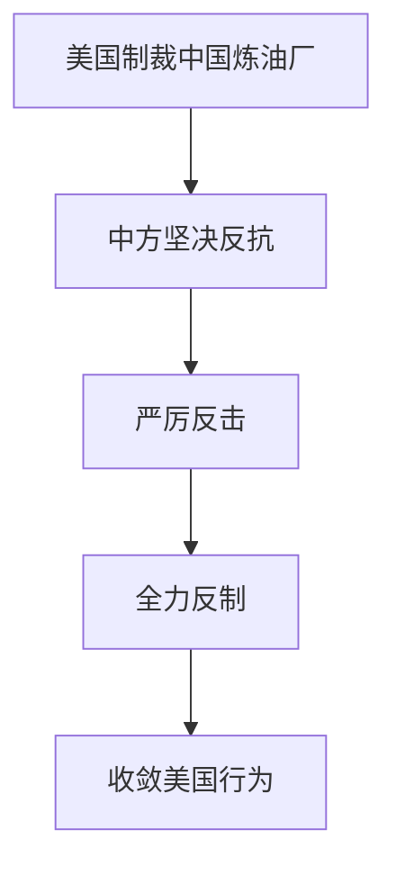

# https://tsearch.toutiaoapi.com/s/magic_frame?from_search_id=20260427224210297ADA4CC572584F4B62&channel=&aid=1455&width=1532&height=1580&search_keyword=%E7%BE%8E%E5%9B%BD%E4%BB%A5%E6%B6%89%E4%BC%8A%E6%9C%97%E4%B8%BA%E7%94%B1%E5%88%B6%E8%A3%81%E4%B8%AD%E4%BC%81&tt_font_size=m&topic_id=7632821618738167818&gd_ext_json=%7B%22hot_board_impr_id%22%3A%2220260427224210297ADA4CC572584F4B62%22%2C%22tab_name%22%3A%22discuss%22%2C%22block_type%22%3A%22discuss%22%2C%22block_name%22%3A%22%E7%83%AD%E9%97%A8%E8%AE%A8%E8%AE%BA%22%2C%22style_id%22%3A%2210153%22%2C%22page_location%22%3A%22search_page%22%2C%22category_name%22%3A%22__search__%22%2C%22entrance_hotspot%22%3A%22search%22%2C%22hot_board_cluster_id%22%3A%227632821618738167818%22%2C%22enter_topic_page_id%22%3A%2220260427224210297ADA4CC572584F4B62%22%2C%22source%22%3A%22client%22%2C%22search_subtab_name%22%3A%22synthesis%22%2C%22content_type%22%3A%22discuss%22%7D&penetrate_data=%7B%22hot_board_impr_id%22%3A%2220260427224210297ADA4CC572584F4B62%22%2C%22tab_name%22%3A%22discuss%22%2C%22block_type%22%3A%22discuss%22%2C%22block_name%22%3A%22%E7%83%AD%E9%97%A8%E8%AE%A8%E8%AE%BA%22%2C%22style_id%22%3A%2210153%22%2C%22page_location%22%3A%22search_page%22%2C%22category_name%22%3A%22__search__%22%2C%22entrance_hotspot%22%3A%22search%22%2C%22hot_board_cluster_id%22%3A%227632821618738167818%22%2C%22enter_topic_page_id%22%3A%2220260427224210297ADA4CC572584F4B62%22%2C%22source%22%3A%22client%22%2C%22search_subtab_name%22%3A%22synthesis%22%2C%22content_type%22%3A%22discuss%22%7D&source=client&style_id=10153&is_new_ui=1&enable_webview_scale=0&initial_offset=12&offset=12&is_top_fold=1&mf_conf=%7B%22page%22%3A%22hotspot_comment%22%2C%22apiIds%22%3A%5B%22hotspot_comment%22%5D%7D&target_channel=magic_frame&enter_keyword=%E7%BE%8E%E5%9B%BD%E4%BB%A5%E6%B6%89%E4%BC%8A%E6%9C%97%E4%B8%BA%E7%94%B1%E5%88%B6%E8%A3%81%E4%B8%AD%E4%BC%81

## 总结

外交部发言人林剑在2026年4月27日例行记者会上，就美国以涉伊朗业务为由制裁中国一家大型民营炼油厂一事做出回应。中方指责美国行为是“公开抢劫”，如同野蛮强盗，必须坚决反制。中方认为，中国企业与伊朗的业务往来是主权国家间的正常交易，美国无权干涉。

## 图解

### 美国制裁行为演变

### 中方反制逻辑

## 对话

### 网民如何评论

> 更新于: 2026-04-27T14:52:09.356Z

#### 用户

网民如何评论

#### 助手

网民对美国的制裁行为表达了强烈不满，认为美国的行为如同强盗和土匪，是公开抢劫。他们支持中国政府的反制措施，认为美国无权干涉中国企业与伊朗的合法业务往来。许多评论强调，面对美国的霸权主义，必须坚决反抗和严厉反击。
